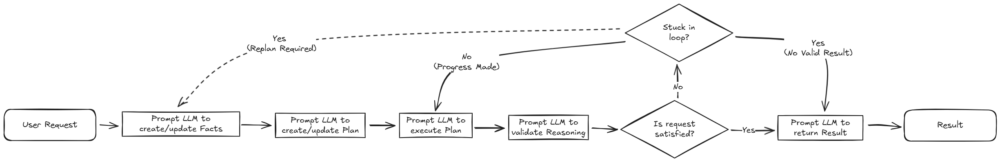

# Azure OpenAI GPT-4o Reasoning+Acting Demo

[](https://codespaces.new/jamesmcroft/gpt4o-reasoning-acting-demo?quickstart=1)

This repository contains a simple demonstration of using OpenAI's GPT-4o model to reason and act, following the principles of the [ReAct pattern](https://arxiv.org/pdf/2210.03629).

> [!IMPORTANT]
> This repository is designed simply as a demonstration of the technique, and is not a production-ready implementation.

## Contents

- [Approach](#approach)
  - [Gathering Facts](#gathering-facts)
  - [Planning](#planning)
  - [Executing](#executing)
  - [Validating Outcomes](#validating-outcomes)
  - [Updating Facts](#updating-facts)
  - [Updating the Plan](#updating-the-plan)
  - [Finalizing the Answer](#finalizing-the-answer)
- [Getting Started](#getting-started)
  - [Pre-requisites](#pre-requisites)
  - [Setup on GitHub Codespaces](#setup-on-github-codespaces)
  - [Setup Locally](#setup-locally)
  - [Login to Azure CLI](#login-to-azure-cli)
- [Run the Demo](#run-the-demo)
- [License](#license)

## Approach

The technique follows a series of prompts to GPT-4o to perform the following steps:



### Gathering Facts

Collecting facts effectively grounds the model's reasoning in verified, recalled, and assumed knowledge based on the provided context.

By retrieving context-specific facts, the model is less likely to generate irrelevant or fabricated information. Additionally, this reasoning trace makes it easier to understand and verify how the final answer was derived.

### Planning

After gathering the necessary facts, by reasoning over the request and available capabilities, the model can breakdown a complex problem into smaller, manageable sub-tasks. This approach reduces the chances of error propagation and allows the model to focus on reaching an end goal more effectively through logical steps.

### Executing

As we make progress, the model can take the necessary actions defined in the plan to produce expected outcomes. By following the plan and executing the steps in a logical order, the model can ensure that the final answer is as correct and complete as possible.

### Validating Outcomes

As each step is executed in the plan, the model can validate the progress that we are making towards the final goal. This verification helps ensure that the plan is still sound, and that any discrepancies between the predicted and actual outcomes can be addressed early.

Any continuous loop in actions or outcomes can be used as indicators for self-correction and re-evaluation of the plan.

### Updating Facts

When the model detects that its initial plan is not producing the expected outcome, it must replan by first updating the facts based on the new context. By updating facts, we are essentially refreshing the model's understanding of the problem, which can lead to a more accurate and effective plan.

Any changes, new observations, and outdated/incorrect information will be reflected in the updated facts.

### Updating the Plan

After the facts have been updated, updating the plan based on the original user request ensures that the model's next steps remain tightly aligned with the user's intent while incorporating new observations. This iterative process of updating facts and plans allows the model to adapt to changing circumstances and improve its reasoning over time.

### Finalizing the Answer

Once we've cycled through rounds of gathering facts, reasoning, acting, and even replanning, producing a final result consolidates all of those iterative steps into a coherent answer.

Producing the final results demonstrates that the model has successfully navigated through the iterative loop of the ReAct pattern, confirming that the reasoning was aligned with the user's request, and that the actions taken were effective in reaching the desired outcome.

## Getting Started

### Pre-requisites

> [!IMPORTANT]
> An Azure subscription is required to run these samples. If you don't have an Azure subscription, create an [account](https://azure.microsoft.com/en-us/).

To get started, you must have the following Azure resources deployed in your subscription:

- Azure OpenAI
  - Latest `gpt-4o` model version
  - Latest `text-embedding-3-large` model version

You must also assign the following role assignments to the Azure OpenAI resource against your Entra ID user:

- `Cognitive Services OpenAI Contributor`

### Setup on GitHub Codespaces

[](https://codespaces.new/jamesmcroft/gpt4o-reasoning-acting-demo?quickstart=1)

The easiest way to get started is to open this repository in GitHub Codespaces. Click the button above to create a new Codespace with all the necessary tools and dependencies pre-installed.

Once the Dev Container is up and running, continue to the [Login to Azure CLI](#login-to-azure-cli) section.

### Setup Locally

To use the Dev Container, you need to have the following tools installed on your local machine:

- Install [**Visual Studio Code**](https://code.visualstudio.com/download)
- Install [**Docker Desktop**](https://www.docker.com/products/docker-desktop)
- Install [**Remote - Containers**](https://marketplace.visualstudio.com/items?itemName=ms-vscode-remote.remote-containers) extension for Visual Studio Code

To setup a local development environment, follow these steps:

> [!IMPORTANT]
> Ensure that Docker Desktop is running on your local machine.

1. Clone the repository to your local machine.
2. Open the repository in Visual Studio Code.
3. Press `F1` to open the command palette and type `Dev Containers: Reopen in Container`.

Once the Dev Container is up and running, continue to the [Login to Azure CLI](#login-to-azure-cli) section.

### Login to Azure CLI

To ensure you can access the Azure OpenAI API, you will need to ensure that you have logged in to the Azure CLI.

```bash
az login
```

> [!NOTE]
> If a specific Azure tenant is required, use the `--tenant <TenantId>` parameter in the `az login` command.
> `az login --tenant <TenantId>`

## Run the Demo

After setting up the Azure environment and configuring a development environment, you will need to create a [`.env`](./.env) file based on the provided [`.env.template`](./.env.template) file. This file requires the following details:

- `OPENAI_ENDPOINT` - The Azure OpenAI endpoint URL (e.g., `https://<resource-name>.openai.azure.com/`)
- `GPT4O_MODEL_DEPLOYMENT_NAME` - The deployment name of the GPT-4o model (e.g., `gpt-4o`)
- `TEXT_EMBEDDING_MODEL_DEPLOYMENT_NAME` - The deployment name of the Text Embedding model (e.g., `text-embedding-3-large`)

Once the [`.env`](./.env) file is created, you can run the demo ReAct Python Notebook using a Python `3.12` kernel to see the technique in action.

- [ReAct Notebook](./ReAct/ReAct.ipynb)

The notebook provides a demo of a simple recipe agent that has the following skills:

- Find a single recipe that best matches the given description.
- Find the ingredients that are available in the kitchen (hard-coded ingredient list)
- Modifies a known recipe to make it vegan-friendly, if it contains meat or dairy products.
- Generate a shopping list based on the ingredients required for a recipe and the available ingredients in the kitchen.

## License

This project is licensed under the [MIT License](./LICENSE).
